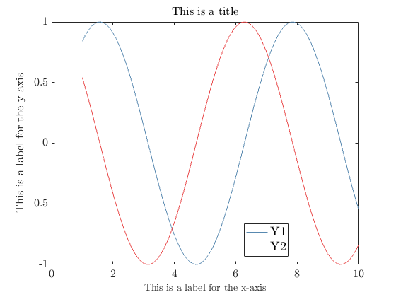
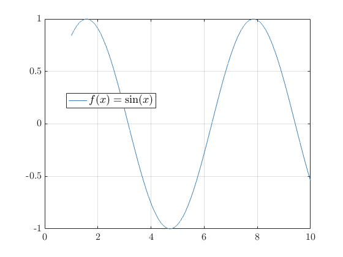
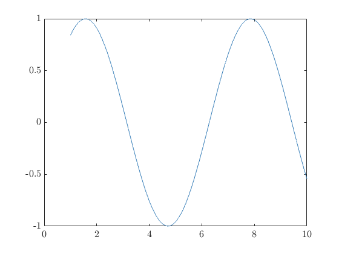
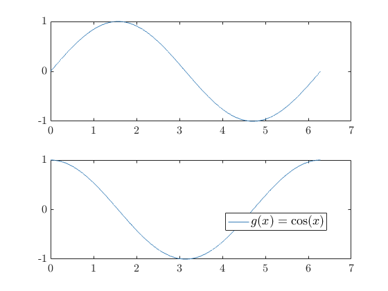

Plotex - A library for plotting data from arrays or Simulink generated `.mat` files with text rendered in `LaTeX`. 
==========================
_Version 1.0.0_
# Table of contents

- [Plotex - A library for plotting data from arrays or Simulink generated `.mat` files with text rendered in `LaTeX`.](#plotex---a-library-for-plotting-data-from-arrays-or-simulink-generated-mat-files-with-text-rendered-in-latex)
- [Table of contents](#table-of-contents)
- [Overview](#overview)
- [Class descriptions & use](#class-descriptions--use)
  - [Data](#data)
  - [Plotex](#plotex)
    - [Data input format](#data-input-format)
    - [Parameter input format](#parameter-input-format)
    - [Some examples](#some-examples)
    - [Changing parameter values](#changing-parameter-values)
  - [Subplotex](#subplotex)
    - [Data input format](#data-input-format-1)
    - [Parameter input format](#parameter-input-format-1)
- [Planned features](#planned-features)

# Overview

_Plotex_, a [portmanteau](https://en.wikipedia.org/wiki/Portmanteau) of _plot_ and _latex_, is a library for simplifying generating good-looking plots from data, either generated by Simulink or general arrays containing data. As the name suggests, all text is rendered in `LaTeX`, making the plots suitable for putting into your `LaTeX` document.

The library features the original Plotex class for generating a single plot with multiple graphs and the Subplotex class for generating a subplot of Plotex plots.

# Class descriptions & use

## Data

The Data class is only implemented as helper class for structuring the data of each graph that eventually will be plotted. **It should therefore never be necessary to directly interact with this class!**

## Plotex

A complete plot is generated with the Plotex constructor, which returns a handle to the plot. The input parameters are divided into two: _data_, which will be plotted, and _parameters_, which affect how the plot looks. 

> _NOTE: The order is important, data __must__ be passed in before parameters!_ 

### Data input format

Two formats for data, or _data sources_, are accepted: A character array or string with the name of a $\texttt{.mat}$ file originating from a Simulink simulation, or two arrays for data along the X- and Y-axis, respectively. In addition to this, _labels_ for each graph must be provided, which are character arrays or strings that will be displayed in the legend of the plot. If a file name is provided, the labels must either be provided as a cell array of the exact same dimension as number of graphs stored in the file, or as individual parameters. For the array input method, the label must be provided as a parameter directly after each XY-data pair.

### Parameter input format

The parameters are passed as name-value-pairs and can be provided in an arbitrary order, as long as the names are correctly spelled and the value is valid for the corresponding parameters. The following parameters are accepted:

| __Name__    | __Valid values__                                                                      | __Description__                                                                                                                                                                                                  |
| ----------- | ------------------------------------------------------------------------------------- | ---------------------------------------------------------------------------------------------------------------------------------------------------------------------------------------------------------------- |
| loglog      | true, false (default)                                                                 | Turn the ordinary plot with linear scale on the axises to axises scaled logarithmically.                                                                                                                         |
| grid        | true, false (default)                                                                 | Turns on a grid over the plot.                                                                                                                                                                                   |
| thick_lines | true, false (default)                                                                 | If true, the linewidth of the graphs is increased. Suitable for plots where the graphs don't overlap too much or are too oscillatory.                                                                            |
| stairs      | true, false (default)                                                                 | Change the graphs from a smooth, continuous graph to zero-hold stairs graphs.                                                                                                                                    |
| figure      | true (default), false                                                                 | Decides if an independet figure handle is initialised for each plot. In practice, decides if a plot should have its own window. Should under normal circumstances not be changed, is only there for subplotting. |
| title       | Character arrays (`'Plot'`) or strings (`"Plot"`). Default is to print no title.      | Gives a title to your plot.                                                                                                                                                                                      |
| xlabel      | Character arrays (`'Time'`) or strings (`"Time"`). Default is to print no xlabel.     | Gives the X-axis of your plot a name.                                                                                                                                                                            |
| ylabel      | Character arrays (`'Values'`) or strings (`"Values"`). Default is to print no ylabel. | Gives the Y-axis of your plot a name.                                                                                                                                                                            |
| legend      | true (default), false                                                                 | Turn on or off the legend in your plot.                                                                                                                                                                          |

> __NOTE: At this time, parameter names _must_ be passed as character arrays (i.e., 'legend') and _not as strings_ ("legend") in order to be parsed correctly!__

### Some examples

__From a file (src.mat) with two graphs (Y1 and Y2):__
```matlab
>> l = {'Y1', 'Y2'};
>> p = Plotex('src.mat', l);
>> p.plot;
```
_or_
```matlab
>> p = Plotex('src.mat', 'Y1', 'Y2');
>> p.plot;
```

__With parameters:__
```matlab
>> p = Plotex('src.mat', 'Y1', 'Y2', 'xlabel', 'This is a label for the x-axis', 'ylabel', 'This is a label for the y-axis', 'title', 'This is a title');
>> p.plot;
```


### Changing parameter values

`Plotex` features two methods, `enable` and `disable`, that as the names suggest, enables or disables the boolean parameters:

```matlab
>> x = 1:0.1:10;
>> y = sin(x);
>> p = Plotex(x, y, '$f(x)=\sin(x)$');
>> p.enable('grid');
>> p.plot;
```

```matlab
>> x = 1:0.1:10;
>> y = sin(x);
>> p = Plotex(x, y, '$f(x)=\sin(x)$');
>> p.disable('legend');
>> p.plot;
```


## Subplotex

_Subplotex_ is used for composing Plotex plots into a subplot. The interface is intentionally similar to Plotex, where the subplot is generated with Subplotex's constructor. The input parameters are split into two parts: The plots, which solely consists of Plotex instances, and the optional parameters for the subplot.

> __NOTE: The order is important, data _must_ be passed in before parameters!__

One thing to note here is that most of the functionality lies within Plotex. Subplotex main function is only to combine the plots into a single window, so in order to customise an individual plot, you need to access the interface of that Plotex instance. This is possible by simply accessing the public member variable `plots` which is a cell array containing all Plotex instances that is contained in the subplot. An example of this is shown below.
```matlab
>> x = 1:0.1:10;
>> y = [sin(x); cos(x)];
>> pl = {Plotex(x, y(1, :), '$f(x)=\sin(x)$'), Plotex(x, y(2, :), '$g(x)=\cos(x)$')};
>> sp = Subplotex(pl);
>> sp.plots{1,1}.disable('legend'); % Accesses the plot in position (1, 1), here it is sin(x).
>> p.plot;
```

### Data input format

Subplotex, contrary to Plotex, can only accept Plotex instances (i.e., it cannot load the from a file). The instances can be passed either in a cell array or as individual parameters. If they are passed in as a cell matrix, the shape of the cell matrix determines the shape of the plots in the subplot, and each plot is placed in its corresponding place. If the data is passed as a parameter list, default is to order the plots vertically. The shape can be set with the `shape` parameter, passing in an array with number of rows as first element and number of columns as second.

### Parameter input format

| __Name__ | __Valid values__                                                                                                                                                                                                                                        | __Description__                                                                                                                                                                                       |
| -------- | ------------------------------------------------------------------------------------------------------------------------------------------------------------------------------------------------------------------------------------------------------- | ----------------------------------------------------------------------------------------------------------------------------------------------------------------------------------------------------- |
| title    | Character arrays (`'Plot'`) or strings (`"Plot"`). Default is to print no title.                                                                                                                                                                        | Gives a title that is displayed on top of the plots in the subplot.                                                                                                                                   |
| shape    | Numeric array containing number of rows and columns, `[rows, columns]`. Default is to either use the same dimensions as the cell array containing the data to be plotted, if provided, or set `rows` to number of plots passed in and `columns` to `1`. | The dimensions passed in must match the dimension of the data passed in. If a cell array is passed at the same time as this parameter, the dimensions specified with this parameter takes precedence. |


# Planned features

- [ ] Add functionality for changing line width of independent graphs in a plot.
- [ ] Functionality for changing colour of graphs.
- [ ] Parser function for generating Plotex instances that are directly passed to a Subplotex instance, instead of doing it in two manual steps, possibly by passing arrays directly to a Subplotex constructor in the same fashion as Plotex.
